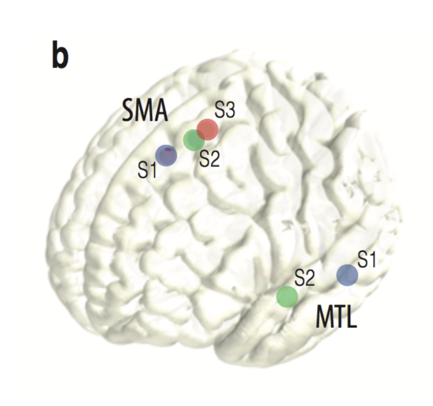
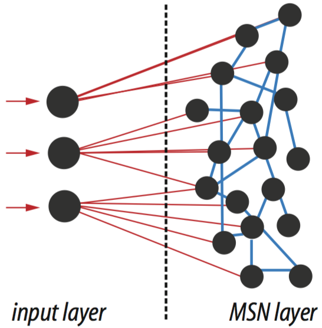
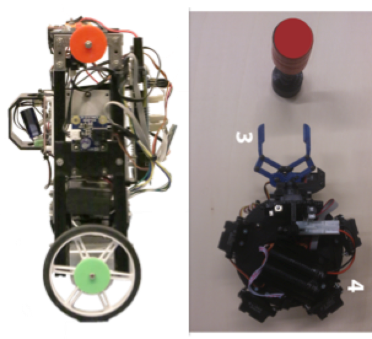
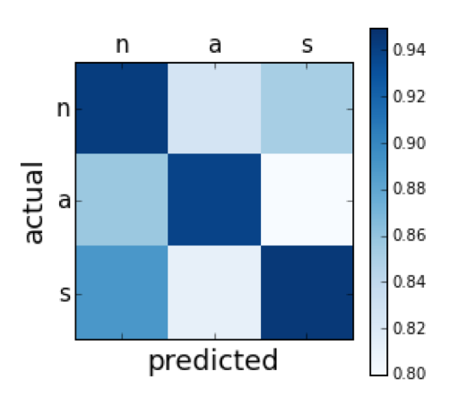

### Reasearch Areas

#### Automatic and Deliberate control of action (electrophysiology)

Some actions are taken volitionally while many others are controlled by automatic routines. How does the human brain orchestrates these two modes? I attempt to answer this question by applying statistical and machine learning methods to neural time series recorded from human subjects implanted with intracortical electrodes and use these insights to classify and predict behavior.

For more info: *Maffei et al. "Theta phase modulates deliberate action switch in human SMAs" (in preparation)*

#### Sensory-motor learning and motor adaptation (computational)

When playing sports, such as football, acting in anticipation is key. What are the learning mechanisms underlying this ability? I design predictive control algorithms that implement neural networks based on the anatomy and physiology of the animal cerebellum and basal ganglia. Through the analysis of their learning dynamics and performance within motor adaptation tasks I attempt to extrapolate the computational principles underlying the control of anticipatory actions.

For more info: *Maffei, G., Herreros, I., Sanchez-Fibla, M., Friston, K. J., & Verschure, P. F. (2017). The perceptual shaping of anticipatory actions. In Proc. R. Soc. B. The Royal Society.*

Newspaper [article](https://www.catalunyavanguardista.com/la-percepcion-da-forma-a-nuestras-acciones/) covering the project

#### Cognitive architectures and neuromorphic control (neuro-robotics)

In order to really understand the brain, we should be able to replicate its fundamental control and learning principles in artifical systems, such as robots. I contribute to this fashinating challenge by studying the system level interactions across brain areas with the goal to implement cognitive architectures that overcome current limitations in artifical intelligence systems and equip machines with real-world adaptive abilites.

For more info: *Maffei, G., Santos-Pata, D., Marcos, E., Sánchez-Fibla, M., & Verschure, P. (2015). An embodied biologically constrained model of foraging: from classical and operant conditioning to adaptive real-world behavior in DAC-X. Neural Networks, 72, 88-108.*

Newspaper [article](https://www.elperiodico.com/es/sociedad/20151219/investigadores-de-la-pompeu-fabra-desarrollan-robot-que-se-comporta-como-rata-4765003) covering the project

#### Clinical diagnitic tools (behavioral)

The knowledge of the computational principles underlying behavior can find concrete applications in clinical setups. I apply the key insights on decision making, predictive control and motor adaptation to diagnostic tools that can detect the disruption of learning mechanisms in syndromes such as autism, or medical conditions such as addiction.

For more info: *Maffei, G., Blancas, M., Vouloutsi, V., Verschure, P. "Measuring collaboration in a predictive game task: a comparison between autistic and neurotypical individuals using the Point of Social Subjective Equality" (in preparation)*

### European Union founded projects

* European Research Council (ERC): cDAC (341196)

* EU Horizon 2020: socSMC (641321) [project page](https://socsmcs.eu/)

* EU 7th Framework: eSMC (270212) [project page](http://esmcs.eu/)

### Collaborators

* Universitat Pompeu Fabra (Marti Sanchez-Fibla)
* University College London (Karl Friston, Ivan Herreros)
* Hospital del Mar - IMIM - Epilepsy Unit (Rodrigo Rocamora)
* Barcelona Beta (Adria Tauste-Campo)
* Hospital Clinic - IDIBABS - Addiction Unit (Antoni Gual)
* UKE Hamburg (Andreas Engel)
* Pal Robotics (Sergi Garcia)

